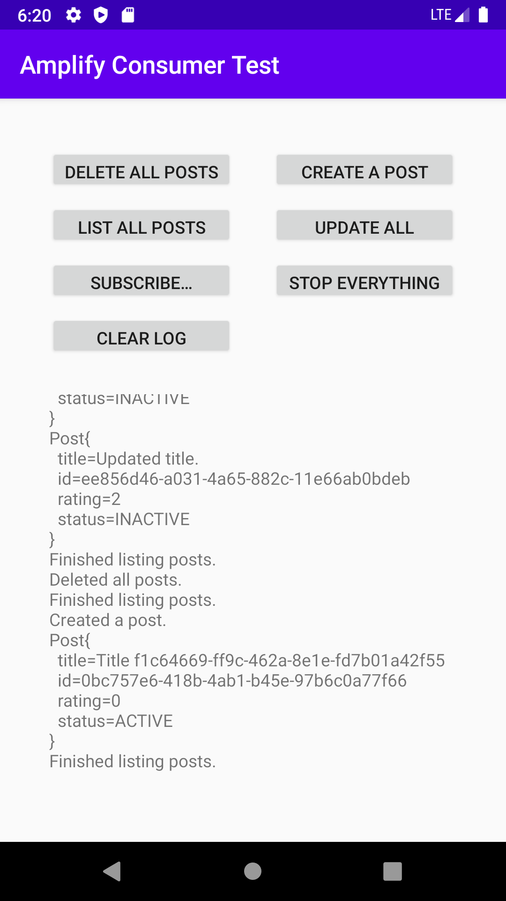
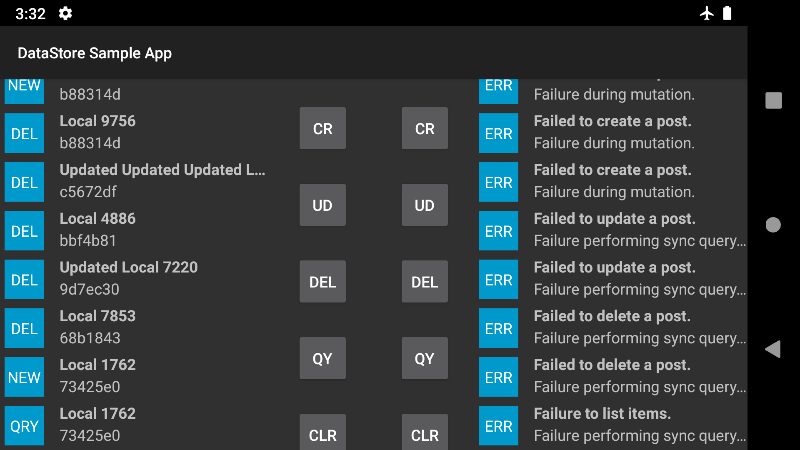

# Simple DataStore Sample App




## Installation
To use, install, and evaluate this application, please do the following:

1. Checkout and build Amplify Android @ `master`.
```sh
./gradlew build publishToMavenLocal
```
Detailed instructions are in the [Contributing
Guide](https://github.com/aws-amplify/amplify-android/blob/master/CONTRIBUTING.md#getting-started).

2. Import this current project into Android studio. Try to build it.

3. Using the [`schema.graphql`](./schema.graphql) as below,
   generate models and deploy an AppSync backend. Make sure that this
   step updates your local configuration.
```graphql
enum PostStatus {
  ACTIVE
  INACTIVE
}

type Post @model {
  id: ID!
  title: String!
  rating: Int!
  status: PostStatus!
}
```

3. Re-build this current app and install it on an Android device.

## Usage
The purpose of this application is to test the Amplify DataStore.

For repeatable results, you should always swipe-kill the app, before
running a manual test case:
```
adb shell am force-stop com.amplifyframework.datastore.sample
adb uninstall com.amplifyframework.datastore.sample
```

You may also manually update/clear your AppSync backend, while using
this app. It can be useful to do this _before_ opening this app, so that
the app won't sync a bunch of old data. The script in `clear-db.sh` is
useful for this.

The best way to understand the behavior of the different buttons is to
read the
[`MainActivity.java`](https://github.com/jamesonwilliams/simple-datastore/blob/master/app/src/main/java/com/amplifyframework/datastore/sample/MainActivity.java).


## Portrait Mode
These are the behaviors of the buttons in the portrait mode of the UI:

1. _CREATE A POST_: Create a single post, with some random data. Display
   this post on the screen.
2. _UPDATE ALL_: Query all posts, and update them all. Display each
   update on the screen.
3. _LIST ALL POSTS_: List all current posts, onto the screen.
4. _DELETE ALL POSTS_: Query all posts, and delete each one. Display
   each deletion to the screen.
5. _SUBSCRIBE..._: Start a new subscription. The subscription will emit
   information about its lifecycle onto the screen.
6. _STOP EVERYTHING_: Stop/cancel any ongoing operation(s). This will
   cancel mutation, and it would also tear down a subscription.
7. _CLEAR LOG_: This doesn't do anything to the DataStore. This just
   clears the log in the app window.

## Landscape Mode

The left side shows client-side state, the right side shows AppSync side
state. As of this time, the right side doesn't include _delete,
_lastChangedAt, _version, so it is of limited utility.


## Advanced Usage

You can also use this app to evaluate open PRs. For example, to evaluate
the open [`3way_merge`
PR](https://github.com/aws-amplify/amplify-android/pull/460), you would:


1. Build Amplify Android, including that change. Publish the artifact
   the local Maven repository.
```
cd ~/amplify-android
git fetch origin
git checkout --track origin/3way_merge -B 3way_merge
./gradlew clean build publishToMavenLocal
```

2. Rebuild this app, to make use of that version of the project.
```
adb uninstall com.amplifyframework.datastore.sample
./gradlew build
adb install -r app/build/outputs/apk/debug/app-debug.apk 
```


